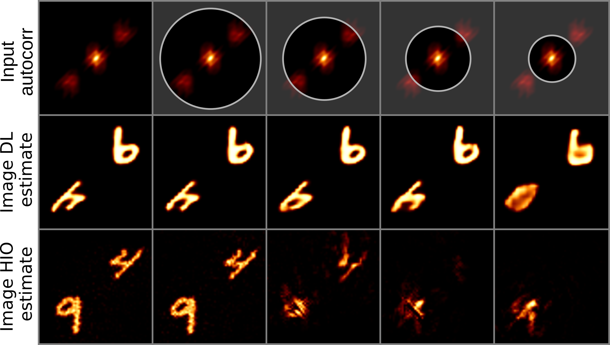

# Phase-Retrieval with Incomplete Autocorrelations Using Deep Convolutional Autoencoders

## Folder structure and code outline

This repository contains the code for the paper **Phase-Retrieval with Incomplete Autocorrelations Using Deep Convolutional Autoencoders**. The folder structure is as follows:

- **check_dataset/val**: contains unpacked items from the validation dataset to be used for the creation of the paper figures;
- **data**: where the MNIST dataset will be downloaded for the creation of the training and validation datasets;
- **datasets**: contains the datasets created by the `create_training_data.py` script;
- **paper_checkpoints**: contains the network checkpoints to be downloaded from [here](https://drive.google.com/drive/folders/1JKlFisSBgb7lJwuLsnEXAwr63Dw8Vo4o?usp=share_link);
- **paper_data**: contains miscellaneous paper data, including training metadata, out of distribution images, etc...;
- **paper_images**: contains the images created with the `paper_plots.ipynb` notebook;
- **Progress**: contains reconstructed images and correlations to monitor the progress of the training process;
- **tb_logs**: contains the tensorboard logs;
- **utils**: contains helper code;
- **working_training_dataset**: contains the uncompressed training dataset to be used during the actual training. All the images must be contained in the **train** subfolder;
- **working_training_dataset**: contains the uncompressed validation dataset to be used during the actual training. All the images must be contained in the **val** subfolder;

## Running the model in evaluation mode and creating the paper figures.

Follow these instructions to run the code in evaluation mode and recreate the paper figures:

1) download and install the [anaconda python distribution](https://www.anaconda.com/products/distribution);
2) clone this repository and move to its folder;
3) create the environment from the `environment.yml` file: `conda env create -f environment.yml`;
4) activate the environment: `conda activate pytorch_lightning`;
5) verify that the environment was installed correctly: `conda env list`;
6) download the network [checkpoints](https://drive.google.com/drive/folders/1JKlFisSBgb7lJwuLsnEXAwr63Dw8Vo4o?usp=share_link) and move them to the **paper_checkpoints** folder;
7) download the [validation dataset](https://drive.google.com/drive/folders/1QV1E2rJL5KyUfqg0Lnih8Pyo7VklWx7B?usp=share_link) and move all the images to the **check_dataset/val** folder
8) open and run the `paper_plots.ipynb` notebook to create the paper figures, and modify it as you see fit to play with the trained models. The notebook runs on a **cpu*** backend and requires a few GB of memory to run correctly. It takes a few minutes to complete the first run, depending on your machine hardware.

## Training the model from scratch

The model was trained on a slurm cluster with several Nvidia V100 GPUs. To train it on your own you should:

- follow the points 1 through 6 from the previous paragraph
- either create (with the `create_training_data.py`) or [download](https://drive.google.com/drive/folders/1QV1E2rJL5KyUfqg0Lnih8Pyo7VklWx7B?usp=share_link) the training and validation datasets, and move all the images to the **working_training_dataset/train** and **working_validation_dataset/val** folders.
- run the `train_slurm.py` script. An example on how to run it can be found in the `train_slurm.sh` shell script. Of course you must adjust all the script parameters according to your hardware and what you want to obtain. Running `python train_slurm.py --help` will return a brief description of each parameter.
